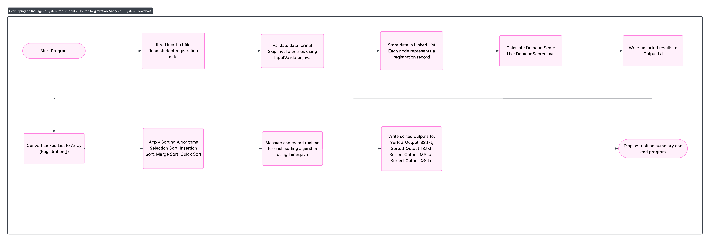

# Appendix A — System Flowchart

The following flowchart illustrates the overall workflow of the system, starting from data input and validation to runtime measurement and output generation.

---

## System Flow Overview

1. Start Program  
2. Read and validate registration data from `Input.txt`.  
3. Store valid data in a **Linked List** structure.  
4. Calculate demand score for each student based on:
   - Base score  
   - Academic level multiplier  
   - Time of registration  
   - Course ID priority  
5. Convert Linked List into an array.  
6. Apply all four sorting algorithms:
   - Selection Sort  
   - Insertion Sort  
   - Merge Sort  
   - Quick Sort  
7. Measure and record execution time for each sorting algorithm.  
8. Write results to `Output.txt` and generate sorted output files.  
9. Display runtime summary and terminate the program.

---

## System Flowchart

**Figure:** Flowchart illustrating the complete system process for course registration analysis.

The diagram above shows the complete data flow in the program.  
Each step corresponds to a core Java class:  
- **InputValidator.java** handles validation.  
- **LinkedList.java** manages data storage.  
- **DemandScorer.java** computes demand scores.  
- **Benchmarker.java** and **Timer.java** record runtimes.  
- **Sorting classes** (`SelectionSort.java`, `InsertionSort.java`, `MergeSort.java`, `QuickSort.java`) implement and compare algorithms.  
This modular design ensures clarity, reusability, and easy debugging.